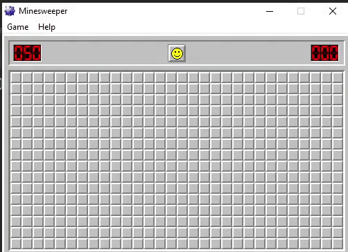

# Mine Sweeper Bot

Eden Yosef

Language: Python

Tools: Pyautogui, Probability

A Bot which solves the popular game "Mine Sweeper"

# Bot Display

# General Description

The purpose of the bot is to find the solution for every board in "Mine Sweeper". In addition, Pyautogui was used to get data from the screen, and control the mouse so the bot can play automatically, and the bot uses probability to know how to solve each board.

# How To Use

1. Copy the files to your computer
2. Run the code (no need to start Winmine.exe before initializing the code)
3. Have fun!

# Game Rules

The object of Minesweeper is to expose all the open areas on the board without hitting an bombs.
